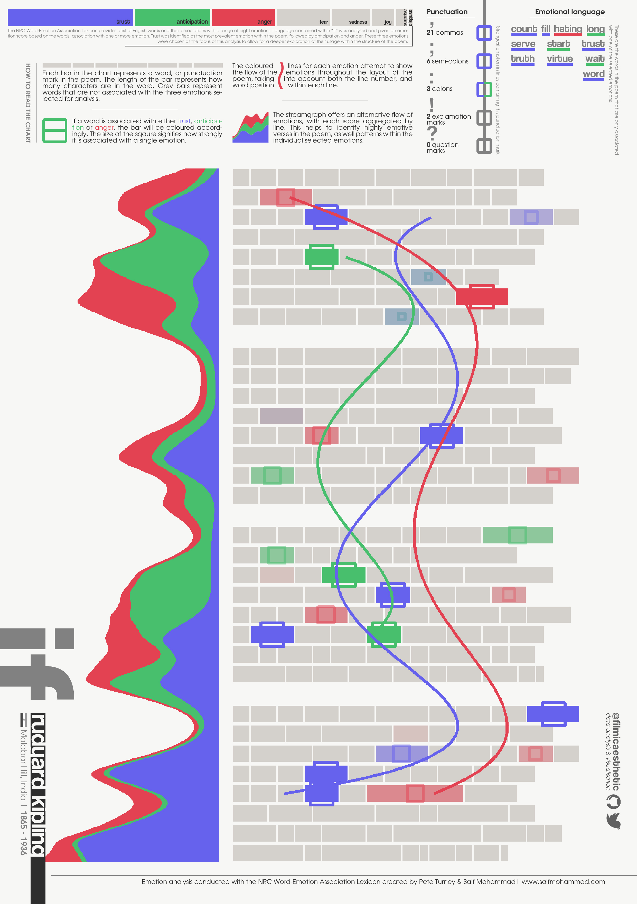

```{r setup, include=FALSE}
knitr::opts_chunk$set(echo = TRUE)
```

## Poetry

### Emotion analysis of Edgar Allan Poe's The Raven

<a href="https://github.com/filmicaesthetic/Art-and-Music/blob/main/Poetry%20Analysis/scripts/PoetryAnalysis.R">See code</a>

```{r, out.width = "500px", echo=FALSE}

```

### Emotion analysis of Rudyard Kipling's If

<a href="https://github.com/filmicaesthetic/Art-and-Music/blob/main/Poetry%20Analysis/scripts/RudyardKipling.R">See code</a>

```{r, out.width = "500px", echo=FALSE}

```

## Music

Visualisation of online guitar tab for Jeff Buckley's cover of Hallelujah

<a href="https://github.com/filmicaesthetic/Art-and-Music/tree/main/Guitar%20Tab%20Analysis/scripts">See code</a>

```{r, out.width = "500px", echo=FALSE}
knitr::include_graphics("Guitar Tab Analysis/outputs/hallelujah_b.gif")
```
